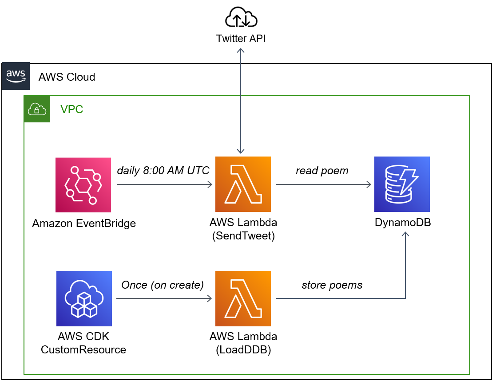

# AWS CDK Twitter Bot Thirukkuralpoem!

This project automatically sets up AWS resources which are used to run an automated Twitter account aka a Twitter Bot.

You can find the Bot here: https://twitter.com/Thirukkuralpoem

What it does is periodically tweeting 1 of 1330 poems, or Kurals, from the Thirukkural which is a classical text by Tamil poets from more than 1000 years ago. You can learn more about the poems [here](https://github.com/tk120404/thirukkural) and [here](https://en.wikipedia.org/wiki/Kural). The former is also where I found the collection of poems used for this project in an easy to process format and including English translations.

From a technical perspective, the project demonstrates a CDK app with an instance of a stack (`ThirukkuralpoemStack`)
which contains:
- two Lambda Functions, 
- a Lambda Layer, 
- a DynamoDB table, 
- an EventBridge schedule to run one of the Lambda Functions regularly and 
- an AWS Custom Resource that is used to call one of the Lambdas exactly once after it was created.

One of the Functions is used to populate the DynamoDB table with the poems and the second one queries the table for a poem once a day and tweets it. I added some logic that cycles over the table depending on the day it's called, so after about 3-4 years of running the Bot the poems will start to become posted repeatedly.



# Running it

You will need your own Twitter account to truly test things out in their entirety but to set everything up to the point that you only need to rename the account names and other specifics do the following:
- Clone the repository
- cd into it
- `pip install -r ./lambda_layer/python/lib/python3.9/site-packages/requirements.txt`
  - The `pip` command downloads the libraries for the Lambda Layer and places them into the correct directory. 
 - (Get Twitter credentials and edit the settings file (see Configuration below))
 
After this you're good to follow the standard instructions on running CDK projects:
- Make sure you have AWS CLI installed on your machine and already linked it to your AWS account using an account with sufficient permissions: ```aws --version```
- Ensure CDK is installed: ```npm install -g aws-cdk```
- Create a Python virtual environment: ```python3 -m venv .venv```
- Activate virtual environment
    - On MacOS or Linux: ```source .venv/bin/activate```
    - On Windows: ```.venv\Scripts\activate.bat```
- Install the required dependencies: ```pip install -r requirements.txt```
- Synthesize (`cdk synth`) or deploy (`cdk deploy`) the project: ```cdk deploy```

# Configuration

Critically you will need to get Twitter API credentials before you deploy the stack in case you want to actually tweet something (see https://developer.twitter.com/en/docs/twitter-api/getting-started/getting-access-to-the-twitter-api). There are also lots of tutorials on obtaining them out there. After you got the credentials, follow the instructions in ```./settings/twitter_settings_template.py```. Here you will need to set all environment variables still showing placeholders.

# Cost
As of the time of this writing, the resources used here are all within the Always Free tier of AWS and far from exceeding it. (Of course you need to keep in mind if you have other resources running that might exceed the free tier in combination with this project)
